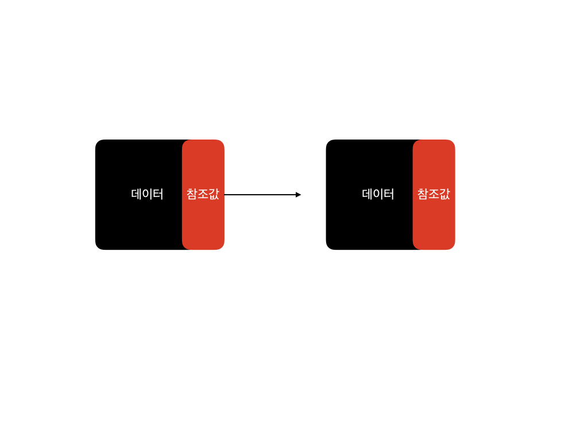

# 링크드리스트(Linked List)
> Python 3.6 기준으로 작성됨

- 링크드리스트는 데이터와 참조로 구성됨
- 다음 노드 혹은 이전 노드를 참조하는 값을 가짐
- 연속된 메모리에 저장되어 있지 않아서 노드 추가가 배열(Array) 에 비해 쉬움
- 하지만 배열과 다르게 인덱스가 없어 특정한 노드를 찾는 게 어려움
- 따라서 데이터의 추가 혹은 삽입이 잦을 경우 링크드리스트를 사용하는 게 더 효율적이고, 탐색 및 정렬이 잦은 경우에는 배열이 효율적이다
- 배열과 다르게 메모리 낭비가 없음(연속된 메모리에 저장되지 않음)

## 종류

- [단순 링크드리스트](./linkedlist.py)
- 이중 링크드리스트
- 원형 링크드리스트
- 청크 링크드리스트

## 시간복잡도

첫번째 데이터 추가/삭제: O(1)
그 외의 데이터 추가/삭제: O(n)
데이터 탐색: O(n)

